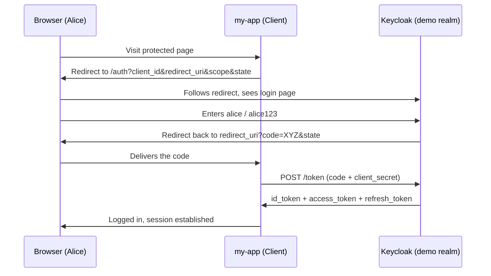

## Where we are in the series

- Post 1 — [What is OpenID Connect?]() — the concepts.
- Post 2 — [Decoding a JWT]() — what's inside the token.
- **This post** — we stop talking abstractly and run a *real* OIDC provider: **Keycloak**. We'll create a realm, register a client, and drive a full login flow with `curl`.

> Everything here is a live, reproducible lab. If you have Docker, you can follow along in ~10 minutes.
{: .prompt-tip }

## What is Keycloak?

**Keycloak** is a free, open-source **Identity and Access Management (IAM)** server. In the language of Post 1, Keycloak plays the role of the **Identity Provider (IdP)** / **OpenID Provider (OP)**.

It gives you, out of the box:

- An **OIDC** and **OAuth 2.0** provider (also SAML 2.0).
- A user database with login pages, registration, password reset, MFA.
- **Federation** — connect to LDAP/Active Directory or social logins (Google, GitHub) as *identity brokers*.
- An admin console + full REST Admin API.

## The mental model: Realms → Clients → Users

Three nested concepts run everything in Keycloak:

```mermaid
graph TD
    KC[Keycloak Server] --> R1[Realm: myrealm]
    KC --> R2[Realm: master &#40;admin only&#41;]
    R1 --> C1[Client: my-app]
    R1 --> C2[Client: mobile-app]
    R1 --> U1[Users]
    R1 --> RO[Roles]
    C1 --> U1
```



- **Realm** — an isolated tenant. Its own users, clients, keys, and settings. `master` is for administering Keycloak itself; **make a separate realm for your apps** — never use `master`.
- **Client** — an application that wants to authenticate users (your **Relying Party** from Post 1). Each client has a `client_id` and, if confidential, a `client_secret`.
- **User** — an account that logs in. **Roles** are assigned to users and can be embedded as claims in tokens.

## Step 1 — Run Keycloak

Start a dev-mode instance with Docker:

```bash
docker run -p 8080:8080 \
  -e KC_BOOTSTRAP_ADMIN_USERNAME=admin \
  -e KC_BOOTSTRAP_ADMIN_PASSWORD=admin \
  quay.io/keycloak/keycloak:26.0 \
  start-dev
```

> `start-dev` uses an in-memory H2 database and disables HTTPS — perfect for learning, **never for production**. For prod you run `start` with a real database, a hostname, and TLS.
{: .prompt-warning }

Open `http://localhost:8080` and log in to the admin console with `admin` / `admin`.

## Step 2 — Create a realm

1. Top-left realm dropdown → **Create realm**.
2. Name it `demo`.
3. Create.

You are now scoped to the `demo` realm. Everything below happens here.

## Step 3 — The discovery document (your map)

Before touching a client, look at what the realm already exposes. Every OIDC provider publishes a **discovery document** at a well-known URL:

```bash
curl -s http://localhost:8080/realms/demo/.well-known/openid-configuration | jq
```

Key fields you'll use:

```json
{
  "issuer": "http://localhost:8080/realms/demo",
  "authorization_endpoint": ".../protocol/openid-connect/auth",
  "token_endpoint": ".../protocol/openid-connect/token",
  "userinfo_endpoint": ".../protocol/openid-connect/userinfo",
  "jwks_uri": ".../protocol/openid-connect/certs",
  "end_session_endpoint": ".../protocol/openid-connect/logout",
  "grant_types_supported": ["authorization_code", "refresh_token", "client_credentials", "..."],
  "response_types_supported": ["code", "id_token", "..."],
  "id_token_signing_alg_values_supported": ["RS256", "ES256", "..."]
}
```

- **`issuer`** — the `iss` claim you'll verify in tokens (Post 2).
- **`token_endpoint`** — where clients exchange codes/credentials for tokens.
- **`jwks_uri`** — the public keys to verify signatures (the JWKS from Post 2).

## Step 4 — Create a user

1. **Users** → **Add user** → username `alice` → Create.
2. **Credentials** tab → **Set password** → e.g. `alice123` → turn **Temporary** *off*.

## Step 5 — Register a client

1. **Clients** → **Create client**.
2. Client type: **OpenID Connect**, Client ID: `my-app` → Next.
3. **Client authentication: On** (this makes it a **confidential** client with a secret) → Next.
4. Set **Valid redirect URIs**: `http://localhost:9090/*` (where your app receives the code).
5. Save.
6. Go to the **Credentials** tab and copy the **Client secret**.

### Confidential vs public clients

| | Confidential | Public |
|--|--------------|--------|
| Has a `client_secret`? | Yes | No |
| Can keep a secret safe? | Yes (server-side app) | No (SPA, mobile) |
| Recommended flow | Auth Code | Auth Code **+ PKCE** |

> **Rule of thumb:** if the code runs in a browser or on a phone, it *cannot* hold a secret — it's a **public** client and **must** use **PKCE** (covered below).
{: .prompt-info }

## OIDC flows: which one do I use?

Keycloak supports several OAuth 2.0 grant types. The ones that matter:

| Flow / Grant | Use it for | Notes |
|--------------|-----------|-------|
| **Authorization Code** | Regular web apps (confidential) | The default, most secure |
| **Authorization Code + PKCE** | SPAs, mobile, CLIs (public) | Auth Code with an anti-interception proof |
| **Client Credentials** | Machine-to-machine, no user | App logs in *as itself* |
| **Refresh Token** | Staying logged in | Trade a refresh token for fresh access tokens |
| ~~**Resource Owner Password**~~ | *(legacy)* | App collects the password directly — **avoid**; deprecated by OAuth |

## Step 6 — Walk the Authorization Code flow

This is the real "Sign in with…" flow from Post 1, now with concrete URLs.



### 6a. Send the user to the authorization endpoint

Your app redirects the browser here (line-broken for readability):

```text
http://localhost:8080/realms/demo/protocol/openid-connect/auth
  ?client_id=my-app
  &response_type=code
  &scope=openid profile email
  &redirect_uri=http://localhost:9090/callback
  &state=RANDOM_ANTI_CSRF_VALUE
```

- `response_type=code` → we want an authorization **code** back.
- `scope=openid ...` → `openid` **must** be present to get an ID Token (Post 1).
- `state` → random value you generate and later verify, to block CSRF.

Alice logs in, and Keycloak redirects back:

```text
http://localhost:9090/callback?code=abc123...&state=RANDOM_ANTI_CSRF_VALUE
```

### 6b. Exchange the code for tokens

Now the app (server-side) trades that short-lived code for tokens:

```bash
curl -s -X POST \
  http://localhost:8080/realms/demo/protocol/openid-connect/token \
  -d grant_type=authorization_code \
  -d client_id=my-app \
  -d client_secret=YOUR_CLIENT_SECRET \
  -d code=abc123... \
  -d redirect_uri=http://localhost:9090/callback | jq
```

Response:

```json
{
  "access_token": "eyJhbGciOiJSUzI1Ni...",
  "expires_in": 300,
  "refresh_token": "eyJhbGciOiJIUzI1Ni...",
  "refresh_expires_in": 1800,
  "id_token": "eyJhbGciOiJSUzI1Ni...",
  "token_type": "Bearer",
  "scope": "openid profile email"
}
```

There they are — the **id_token** and **access_token** from Post 2, signed with **RS256**.

## Step 7 — The fast path: get a token in one call

For a quick lab test without a browser, use the **Client Credentials** grant (app-as-itself, no user):

```bash
curl -s -X POST \
  http://localhost:8080/realms/demo/protocol/openid-connect/token \
  -d grant_type=client_credentials \
  -d client_id=my-app \
  -d client_secret=YOUR_CLIENT_SECRET | jq -r .access_token
```

Copy that token and paste it into [jwt.io](https://jwt.io) (from Post 2) to see the claims Keycloak issued.

## Step 8 — Verify a token the right way

Remember the Post 2 checklist — signature match is **not enough**. Against Keycloak you verify:

1. **Signature** — using a public key from the realm's `jwks_uri`:
   `http://localhost:8080/realms/demo/protocol/openid-connect/certs`
2. **`iss`** equals `http://localhost:8080/realms/demo`.
3. **`aud`** matches your client / API.
4. **`exp`** hasn't passed.
5. Optionally the **`azp`** (authorized party) claim = the client that requested it.

You can also let Keycloak introspect a token for you:

```bash
curl -s -X POST \
  http://localhost:8080/realms/demo/protocol/openid-connect/token/introspect \
  -d client_id=my-app \
  -d client_secret=YOUR_CLIENT_SECRET \
  -d token=ACCESS_TOKEN | jq
# → {"active": true, "sub": "...", "username": "alice", ...}
```

> **Introspection vs local verification:** local JWT validation (with JWKS) is fast and needs no network call per request — prefer it for APIs. Introspection asks Keycloak live and works even for opaque tokens, but adds a round-trip.
{: .prompt-info }

## Step 9 — Fetch the user profile (UserInfo)

With an access token that has the `openid` scope:

```bash
curl -s http://localhost:8080/realms/demo/protocol/openid-connect/userinfo \
  -H "Authorization: Bearer ACCESS_TOKEN" | jq
```

```json
{
  "sub": "b1c2...-uuid",
  "preferred_username": "alice",
  "email": "alice@example.com",
  "email_verified": true
}
```

## Step 10 — Refresh and logout

**Refresh** (get a new access token without re-login):

```bash
curl -s -X POST \
  http://localhost:8080/realms/demo/protocol/openid-connect/token \
  -d grant_type=refresh_token \
  -d client_id=my-app \
  -d client_secret=YOUR_CLIENT_SECRET \
  -d refresh_token=YOUR_REFRESH_TOKEN | jq
```

**Logout** (invalidate the session at the provider):

```bash
curl -s -X POST \
  http://localhost:8080/realms/demo/protocol/openid-connect/logout \
  -d client_id=my-app \
  -d client_secret=YOUR_CLIENT_SECRET \
  -d refresh_token=YOUR_REFRESH_TOKEN
```

## Bonus: shaping what's inside the token

Keycloak decides token contents through:

- **Client scopes** — bundles of claims attached to a client (`profile`, `email`, `roles`, plus custom ones).
- **Mappers** — rules that copy user attributes, roles, or group memberships into specific claims. Example: add a `roles` claim so your API can authorize by role.

This is how the *authorization* data from Post 1 (what you're allowed to do) gets into the token alongside the *authentication* data (who you are).

## Production checklist (don't ship the lab)

- Run `start` (not `start-dev`) with **TLS** and a real hostname (`KC_HOSTNAME`).
- Use a persistent database (PostgreSQL, etc.), not H2.
- Public clients → **Auth Code + PKCE**, never store a secret in a browser.
- Short **access-token** lifetimes; rely on refresh tokens.
- Rotate signing keys; your apps auto-pick them up via `kid` + JWKS.
- Lock down **redirect URIs** to exact paths — no open wildcards on real hosts.
- Never expose or use the `master` realm for applications.

## The one-paragraph takeaway

**Keycloak** is a ready-made OIDC **Identity Provider** you can run in one Docker command. You isolate apps in a **realm**, register each app as a **client**, and it exposes the standard OIDC machinery at `/.well-known/openid-configuration`: an **auth endpoint** to log users in, a **token endpoint** to exchange the code for **id/access/refresh tokens**, a **JWKS endpoint** to verify signatures (Post 2), and **userinfo/introspection/logout** endpoints. Confidential apps use the **Authorization Code** flow; browser and mobile apps use **Auth Code + PKCE**. Everything you read about abstractly in Posts 1 and 2 is now something you can `curl`.

> **Next up:** wiring Keycloak into a real application (a small web app that actually performs this login), and adding **PKCE** step by step.
{: .prompt-tip }
