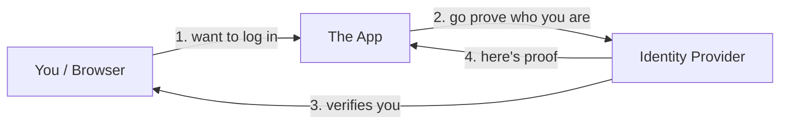
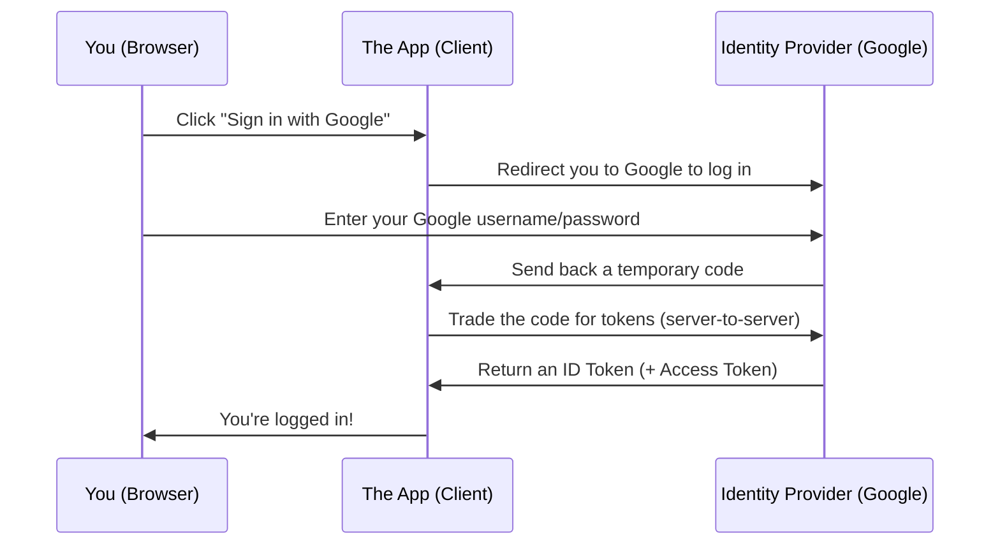

## Start with a familiar problem

Think about how many online accounts you have. Every new website asks you to **create yet another password**, and every one of them ends up storing your credentials somewhere. That's a headache for you (more passwords to remember) and a risk for everyone (one breached site leaks one more password).

Now think about your **passport**. You don't get a new passport for every country you visit. One trusted authority — your government — verified your identity *once* and issued a document that every border checkpoint accepts. The checkpoint doesn't re-run a background check; it trusts the issuer and inspects the passport.

**OpenID Connect (OIDC) brings that same idea to the web.** Instead of every website verifying you from scratch, one trusted service (like Google, GitHub, or your company's login) verifies you *once*, and other websites accept that proof. That's what's happening every time you click **"Sign in with Google."**

> This is exactly what people mean by **Single Sign-On (SSO)**: log in once, get into many apps.
{: .prompt-tip }

## First, clear up one common confusion

Two words sound the same but mean different things:

| Term | Question it answers | Everyday example |
|------|--------------------|------------------|
| **Authentication** | *Who are you?* | Showing your passport at the border |
| **Authorization** | *What are you allowed to do?* | Your visa says "allowed to work" |

- **OAuth 2.0** was built for **authorization** — letting an app access *some of your stuff* (like your photos) without giving it your password.
- **OIDC** is a thin layer **on top of OAuth 2.0** that adds **authentication** — actually proving *who you are*.

> One line to remember: **OIDC = OAuth 2.0 + a verified answer to "who is this user?"**
{: .prompt-info }

## The cast of characters

Every OIDC flow has three players:

- **You** — the *End User* sitting at the browser.
- **The App** — the website or service you want to use. In spec-speak this is the **Client** or **Relying Party (RP)** (it *relies* on someone else to vouch for you).
- **The Identity Provider (IdP)** — the trusted service that checks your identity, e.g. Google, GitHub, Okta, or Keycloak. In spec-speak it's the **OpenID Provider (OP)**.



## How a login actually flows

Here's the classic "Sign in with Google" journey, step by step:



The important idea: **the App never sees your Google password.** It only receives a *token* — a signed note from Google saying "yes, this is really the user who just logged in."

## The star of the show: the ID Token

OIDC's headline feature is the **ID Token**. It's a **JWT** (JSON Web Token) — basically a small, digitally *signed* JSON message. Decoded, it looks roughly like this:

```json
{
  "iss": "https://accounts.google.com",   // who issued it (the IdP)
  "sub": "10769150350006150715113082367", // stable unique ID for the user
  "aud": "your-app-client-id",            // who it was issued FOR (your app)
  "exp": 1736251200,                       // expiry time
  "iat": 1736247600,                       // issued-at time
  "email": "ada@example.com",
  "name": "Ada Lovelace"
}
```

Those short keys are called **claims** — statements *about* the user. A few worth knowing:

- `iss` (**issuer**) — which IdP made this token.
- `sub` (**subject**) — the user's permanent unique ID. Use *this*, not email, as the real identifier (emails can change).
- `aud` (**audience**) — which app the token is meant for.
- `exp` — when it stops being valid.

Because it's **signed** by the IdP, your app can verify it's genuine and untampered — like checking a hologram on an ID card.

> **ID Token vs Access Token** — a frequent mix-up:
> - **ID Token** → for *your app*, answers "who is this user?" (authentication).
> - **Access Token** → for *calling APIs*, answers "what may this app do on the user's behalf?" (authorization).
{: .prompt-warning }

## A few more words you'll keep hearing

- **Scopes** — what info the app is asking for. `openid` is required to turn on OIDC; adding `profile` and `email` asks for name and email.
- **Discovery document** — a public config file at `/.well-known/openid-configuration` that tells apps where all the IdP's endpoints live, so setup is mostly automatic.
- **UserInfo endpoint** — an API the app can call with the Access Token to fetch extra profile details.

## Why should a beginner care?

- **No new passwords** — fewer accounts to manage and leak.
- **The app never handles your password** — smaller attack surface.
- **It's a standard** — Google, Microsoft, GitHub, Okta, Keycloak all speak it, so the same idea works everywhere.

## The one-paragraph takeaway

**OpenID Connect** is a standard that lets you prove who you are to a website using a trusted third party (an *Identity Provider*), without handing that website your password. The app gets a signed **ID Token** full of **claims** about you, verifies its signature, and logs you in. It's built on **OAuth 2.0**, adds the missing "who are you?" piece, and it's what powers every "Sign in with…" button you've ever clicked.

> **Next up:** In a follow-up post we'll actually decode a real JWT and walk through verifying its signature.
{: .prompt-tip }
