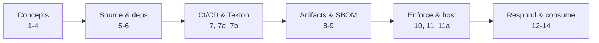

## Start with a familiar problem

When you buy a bottle of medicine, you trust a chain you never see. Someone grew or synthesised the ingredients, a factory mixed them, a lab tested the batch, a **tamper-evident seal** went on the cap, and a courier delivered it. You didn't inspect any of that. You trusted the seal, the label, and the reputation of everyone in the chain — and any one of them could have been the weak link.

Software works the same way. The code you ship is assembled from other people's packages, base images, build tools, and CI systems. You wrote a fraction of what you deploy. **Software supply chain security** is the practice of making that invisible chain trustworthy: knowing where each piece came from, proving it wasn't tampered with, and refusing to run anything you can't verify.

This series walks that chain end to end — from a developer's commit to a running workload — and shows the controls that make each link verifiable.

> **This is the series index (Post 0).** It's a map, not a tutorial. If you're new to the topic, start with [What is software supply chain security?](). If you already know the landscape, jump straight to the reading path that matches your job below.
>
> Last reviewed: 2026-09-16.
{: .prompt-info }

## Who this series is for

Engineers and security practitioners who are technically capable but new to *this specific* topic. You don't need prior supply chain knowledge. You do need to be comfortable with the command line, Git, containers, and basic Kubernetes.

The entries aren't all the same shape. Some are **hands-on walkthroughs** you read start to finish; others are **reference notes** you'll come back to when you need to look something up (the standards tracker in Post 2, for example). Read the walkthroughs in order, and keep the reference posts bookmarked.

By the end you'll be able to:

- Explain the threats and the standards (SSDF, SLSA, SBOM guidance, the EU CRA) without hand-waving.
- Sign and verify commits, container images, and other artifacts with Sigstore.
- Generate and consume SBOMs, and cut vulnerability noise with VEX.
- Produce SLSA build provenance from a real pipeline (GitHub Actions and Tekton Chains).
- Enforce policy at deploy time so unverified software simply doesn't run.
- Run your own private Sigstore when the public-good instance isn't an option.

## Pick a reading path

You don't have to read all 18 posts in order. Start where your problem is.

| I am… | Read, in this order |
|-------|---------------------|
| **New to the topic** | 1 → 2 → 3 → 4, then follow your interest |
| **Running CI/CD** | 7 → 7a → 7b → 9 → 10 |
| **Chasing compliance evidence** | 2 → 8 → 12, plus 9 for attestations |
| **On Tekton / OpenShift** | 4 → 7a → 7b → 11 → 11a |

## The full series

Status is **published** or **coming soon**. Titles link to the post once it's live.

| # | Post | In one line | Status |
|---|------|-------------|--------|
| 0 | Series Guide (this page) | Map, reading paths, and how it stays current | Published |
| 1 | [What is software supply chain security?]() | The mental model and the threat landscape | Published |
| 2 | [The standards landscape](https://anis-verse.github.io/notes/#TODO-post-2) | SSDF, SLSA, SBOM guidance and the CRA, with current versions | Coming soon |
| 3 | [What code signing really is](https://anis-verse.github.io/notes/#TODO-post-3) | Hashing, keys, signatures vs attestations | Coming soon |
| 4 | [Sigstore explained](https://anis-verse.github.io/notes/#TODO-post-4) | Keyless signing, transparency logs, trust roots | Coming soon |
| 5 | [Securing source code](https://anis-verse.github.io/notes/#TODO-post-5) | Identity, branch protection, signed commits, secret scanning | Coming soon |
| 6 | [Securing dependencies](https://anis-verse.github.io/notes/#TODO-post-6) | Pinning, proxying, scanning, provenance | Coming soon |
| 7 | [Hardening CI/CD](https://anis-verse.github.io/notes/#TODO-post-7) | Least privilege, OIDC federation, dangerous triggers | Coming soon |
| 7a | [Tekton and SLSA](https://anis-verse.github.io/notes/#TODO-post-7a) | Building a hardened pipeline platform | Coming soon |
| 7b | [Tekton Chains deep dive](https://anis-verse.github.io/notes/#TODO-post-7b) | Automatic signing and SLSA provenance | Coming soon |
| 8 | [SBOMs and VEX](https://anis-verse.github.io/notes/#TODO-post-8) | Knowing what's inside and what actually matters | Coming soon |
| 9 | [Signing and attesting artifacts](https://anis-verse.github.io/notes/#TODO-post-9) | Cosign, provenance, and where signatures live | Coming soon |
| 10 | [Enforcing at deploy time](https://anis-verse.github.io/notes/#TODO-post-10) | Admission control and policy as code | Coming soon |
| 11 | [Running a private Sigstore](https://anis-verse.github.io/notes/#TODO-post-11) | Self-hosted signing with Keycloak | Coming soon |
| 11a | [Lab: Chains + private Sigstore + policy](https://anis-verse.github.io/notes/#TODO-post-11a) | The full stack, end to end | Coming soon |
| 12 | [Vulnerability response and compliance](https://anis-verse.github.io/notes/#TODO-post-12) | Monitoring, triage, and CRA reporting | Coming soon |
| 13 | [The AI and ML supply chain](https://anis-verse.github.io/notes/#TODO-post-13) | Models, data, and agent tools | Coming soon |
| 14 | [Verifying what you consume](https://anis-verse.github.io/notes/#TODO-post-14) | The consumer's practical guide | Coming soon |

## Prerequisites

The series assumes working knowledge of identity and tokens, because signing identities and OIDC federation come up constantly. If any of that is fuzzy, read these first — they're from the same blog and use the same style:

- [What Is OpenID Connect (OIDC)? A Beginner's Guide]() — how one trusted issuer proves who you are.
- [Decoding a JWT: Reading and Verifying a Real Token]() — what's actually inside an identity token.
- [Keycloak as an OIDC Provider]() — running a real OIDC provider, which we reuse when we self-host Sigstore.

> Keyless signing (Post 4) issues certificates based on OIDC identity tokens. If you understand the JWT and OIDC posts, Sigstore's trust model will feel obvious instead of magic.
{: .prompt-tip }

## What this series does not solve

Being honest about limits is a theme in every post, so let's set expectations up front:

- **It won't secure code that is insecure by design.** Provenance proves *where* code came from, not that it's *good*. You still need code review, testing, and threat modelling.
- **Signatures and provenance are evidence, not policy.** "It has a signature" means nothing until you enforce "signed by *this expected identity*." That gap is why Posts 9 and 10 exist.
- **It's not a compliance checkbox.** The standards (Post 2) are frameworks, not guarantees. Mapping controls to SSDF or SLSA helps you reason and report; it doesn't make you secure on its own.
- **Tools change fast.** Versions, flags, and defaults drift. Every post carries a *Last reviewed* date and a changelog — treat anything older than its review window as "verify before you rely on it."

## How this series is kept current

Supply chain tooling moves quickly, so the series is maintained, not frozen:

- **Last reviewed dates** — every post's series callout shows when its facts were last checked against primary sources.
- **Changelogs** — each post ends with a dated changelog so you can see what changed and when.
- **The living tracker** — Post 2 doubles as a current-versions tracker, with a "Last checked" column for each standard and tool.
- **Radar posts** — periodic "Supply Chain Radar" round-ups summarise notable standards, tooling, and incident news, and flag which earlier posts need a refresh.
- **The companion lab repo** — all runnable labs live in one repository so you can clone, pin, and follow along: `#TODO-lab-repo`.

## Checklist: start this week

- [ ] Read Posts 1–4 to build the mental model and vocabulary.
- [ ] If you're missing identity fundamentals, read the OIDC and JWT prerequisite posts.
- [ ] Bookmark Post 2 (the living tracker) for current versions of every standard and tool.
- [ ] Pick the reading path that matches your role and block time for the first two posts.
- [ ] Clone the companion lab repo so you're ready to run the hands-on sections.

## Key takeaways

- Software supply chain security is about making an invisible chain of dependencies, builds, and delivery *verifiable* — not just trusted.
- The series takes you from concepts to a working, enforced pipeline, with a hands-on lab in most posts.
- You can read by role: pick a path instead of grinding through every post in order.
- Identity is the foundation — the OIDC, JWT, and Keycloak prerequisites pay off throughout.
- Everything here has limits; each post says plainly what its technique does *not* solve.
- The content is kept current with review dates, changelogs, a living tracker, and radar posts.

## What's next

Start with [What is software supply chain security?](https://anis-verse.github.io/notes/#TODO-post-1) to build the mental model the rest of the series depends on, then move to [The standards landscape](https://anis-verse.github.io/notes/#TODO-post-2) to see how SSDF, SLSA, SBOM guidance, and the CRA fit together.

## References

- OpenSSF, *Concise Guide for Developing More Secure Software* — <https://best.openssf.org/Concise-Guide-for-Developing-More-Secure-Software>
- NIST, *Secure Software Development Framework (SSDF), SP 800-218* — <https://csrc.nist.gov/pubs/sp/800/218/final>
- SLSA, *Supply-chain Levels for Software Artifacts* — <https://slsa.dev/>
- Sigstore documentation — <https://docs.sigstore.dev/>
- CISA, *Software Bill of Materials (SBOM)* — <https://www.cisa.gov/sbom>
- EU Cyber Resilience Act overview — <https://digital-strategy.ec.europa.eu/en/policies/cyber-resilience-act>

## Changelog

- 2026-09-16: First published.
