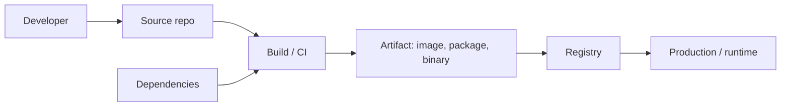

## Start with a familiar problem

Think about a jar of pasta sauce on a supermarket shelf. Before it reached you, tomatoes were grown on a farm, trucked to a factory, cooked with herbs and oil from other suppliers, poured into a jar made somewhere else, sealed with a **tamper-evident lid**, labelled with an ingredients list, and shipped through a warehouse. You never watched any of that happen. You trust the jar because of the seal, the label, and the reputation of the brand.

Now imagine someone slips something harmful into the herbs at the supplier — not the factory, not the shop, just one ingredient far up the chain. Every jar that uses those herbs is now unsafe, and the seal on the lid looks perfectly fine. Thousands of shoppers are affected, and none of them did anything wrong.

Software is built the same way. The application you ship is assembled from open-source packages, base container images, build tools, and CI/CD systems — most of which you did not write and never inspect. **Software supply chain security** is the practice of making that assembly line trustworthy: knowing where every ingredient came from, proving nothing was swapped along the way, and refusing to ship or run anything you cannot verify.

> **This is Post 1 in the series "Securing the Software Supply Chain."** It builds the mental model that every later post depends on, so start here if you're new. There are no prerequisites beyond comfort with Git, containers, and the command line — but if identity and tokens are fuzzy, the [OpenID Connect]() and [JWT]() posts will help later.
>
> Last reviewed: 2026-09-16.
{: .prompt-info }

## What "the supply chain" actually means

In everyday use, the **software supply chain** is everything that touches your code on its way from a developer's keyboard to a running workload. That includes the people, the source code, the third-party dependencies, the build system, the artifacts produced, the registries that store them, and the deployment target.

Here's the whole path at a glance:



Every arrow in that diagram is a hand-off, and every hand-off is a place where something can be added, swapped, or stolen. A useful way to name the risk at each stage is to ask: *what would an attacker gain by compromising this box, and how would anyone downstream notice?*

| Stage | What lives here | What an attacker wants |
|-------|-----------------|------------------------|
| Developer | Credentials, laptops, commit rights | Push malicious code as a trusted author |
| Source repo | Code, history, branch rules | Merge unreviewed or backdoored changes |
| Dependencies | Third-party packages and actions | Poison a package many projects pull in |
| Build / CI | Secrets, publishing rights, signing keys | Tamper with the build; steal tokens |
| Artifact / registry | Images, packages, binaries | Replace a good artifact with a bad one |
| Production | Running software, live data | Run unverified code with real access |

## Why attackers target the supply chain

Attacking software directly — finding a bug in one company's app — is retail crime: one target, one payoff. Attacking the supply chain is wholesale. **Compromise one widely used component, and you reach everyone who depends on it.** One poisoned package, build server, or CI action can fan out to thousands of downstream projects, most of whom trusted it without looking.

Three properties make the supply chain especially attractive:

- **Leverage.** A single upstream compromise hits many victims at once, often across unrelated organisations.
- **Trust by default.** We pull dependencies and reuse actions constantly, usually without verifying who published them or whether they changed.
- **Weak visibility.** Once malicious code is inside a signed, "official" build, downstream users have almost no way to tell it apart from a legitimate one.

That last point is the heart of it. A build can be perfectly signed and still be malicious, because the signature only proves *who built it*, not *whether the inputs were clean*. We'll come back to that limit throughout the series.

## The incidents that prove the point

These are real, widely documented compromises. Each one hit a specific stage of the chain. Dates are the widely reported public-disclosure timeframes; see the linked sources for detail.

| Incident | When | Stage hit | What happened (one line) |
|----------|------|-----------|--------------------------|
| **event-stream** | Nov 2018 | Dependencies | A handed-over npm maintainer role was used to add a malicious dependency targeting a specific bitcoin wallet app. |
| **SolarWinds (SUNBURST)** | Dec 2020 | Build / CI | Attackers implanted a backdoor in the Orion build process; a validly signed update shipped to thousands of customers. |
| **Codecov** | Apr 2021 | Build / CI | A tampered Bash Uploader script skimmed environment secrets from countless CI pipelines. |
| **3CX** | Mar 2023 | Build / artifact | A signed desktop app was trojanised — itself the result of an earlier supply chain compromise (a cascading attack). |
| **xz utils (CVE-2024-3094)** | Mar 2024 | Dependencies | A long-game maintainer planted a backdoor in liblzma aimed at OpenSSH; caught by chance before wide release. |
| **tj-actions/changed-files (CVE-2025-30066)** | Mar 2025 | Build / CI | A compromised token let attackers rewrite release tags so the action dumped CI secrets into build logs. |
| **Shai-Hulud npm worm** | Sep 2025 | Dependencies | The first self-propagating npm worm: it stole tokens and used them to auto-publish infected versions of other packages. |

A few patterns jump out:

- **Maintainer trust is a target.** event-stream, xz utils, and Shai-Hulud all abused legitimate publishing rights rather than breaking in through a bug.
- **A valid signature is not safety.** SolarWinds and 3CX both shipped properly signed software that was malicious. Signing proves origin, not intent.
- **CI is where the crown jewels sit.** Codecov and tj-actions targeted the build system directly, because that's where secrets and publishing rights live.
- **Automation cuts both ways.** Shai-Hulud showed a worm spreading "at the speed of CI/CD" — the same automation that ships software fast also spreads compromise fast.

> The xz utils backdoor was discovered by a single engineer who noticed SSH logins were about half a second slower than usual. Do not build your strategy on getting that lucky.
{: .prompt-warning }

## Producer vs consumer: who is responsible for what

Almost everyone is both a **producer** (you ship software others depend on) and a **consumer** (you pull in software from others). The controls differ depending on which hat you're wearing, and most real security gaps come from forgetting you're wearing both.

| | Producer (you ship it) | Consumer (you use it) |
|--|------------------------|-----------------------|
| **Goal** | Let others trust what you publish | Trust only what you can verify |
| **Source** | Protect branches, sign commits | Review what a dependency actually does |
| **Dependencies** | Pin and vet what you build on | Pin versions; check provenance |
| **Build** | Harden CI, produce provenance | Prefer artifacts with provenance |
| **Release** | Sign artifacts and attestations | Verify signatures and identities |
| **Runtime** | Publish SBOMs and advisories | Enforce policy before you deploy |

The mindset shift the series pushes for: as a producer, generate *evidence* (signatures, provenance, SBOMs) so others don't have to take your word for it. As a consumer, *verify that evidence* instead of trusting a name or a green checkmark. Most of this series is about producing and consuming that evidence well.

## A preview of the controls ahead

The rest of the series works stage by stage through the diagram above. Here's the map, so you can see where each control fits.

| Concern | Control | Where in the series |
|---------|---------|---------------------|
| Shared vocabulary and standards | SSDF, SLSA, SBOM guidance, the EU CRA | [The standards landscape](https://anis-verse.github.io/notes/#TODO-post-2) |
| Proving origin | Code signing and Sigstore | [Code signing](https://anis-verse.github.io/notes/#TODO-post-3), [Sigstore](https://anis-verse.github.io/notes/#TODO-post-4) |
| Source integrity | Branch protection, signed commits, secret scanning | [Securing source code](https://anis-verse.github.io/notes/#TODO-post-5) |
| Dependency safety | Pinning, proxying, scanning, provenance | [Securing dependencies](https://anis-verse.github.io/notes/#TODO-post-6) |
| Build integrity | Least-privilege CI, hardened pipelines, provenance | [Hardening CI/CD](https://anis-verse.github.io/notes/#TODO-post-7) and the Tekton posts |
| Knowing what's inside | SBOMs and VEX | [SBOMs and VEX](https://anis-verse.github.io/notes/#TODO-post-8) |
| Trusting artifacts | Signing and attesting | [Signing and attesting](https://anis-verse.github.io/notes/#TODO-post-9) |
| Enforcement | Admission control and policy | [Enforcing at deploy time](https://anis-verse.github.io/notes/#TODO-post-10) |
| Response | Monitoring, compliance, incident handling | [Vulnerability response](https://anis-verse.github.io/notes/#TODO-post-12) |

Don't worry about the acronyms yet — each gets a full, plain-language treatment in its own post. The point here is that supply chain security isn't one tool; it's a set of controls at every hand-off, backed by evidence.

## What this does not solve

Supply chain security is powerful, but it is not a magic shield. Being clear about the limits keeps you from a false sense of safety.

- **It does not make bad code good.** Provenance and signatures prove *where* code came from, not that it's well written or free of vulnerabilities. You still need code review, testing, and threat modelling.
- **It does not stop a trusted insider or a hijacked account.** event-stream and xz utils came from maintainers with legitimate rights. Strong identity and review reduce this risk, but no signature catches a betrayal by a trusted party.
- **A signature alone proves almost nothing useful.** "It's signed" is not a policy. "It's signed by *this expected identity*, built by *this expected workflow*" is. Turning evidence into enforcement is a whole topic on its own ([Post 10](https://anis-verse.github.io/notes/#TODO-post-10)).
- **It is not a one-time project.** Dependencies update, tools change defaults, and new incident classes appear (self-spreading worms didn't exist as a live npm threat until 2025). This is an ongoing practice, not a checkbox.

## Try it: score a real repository with OpenSSF Scorecard

Let's make this concrete. **OpenSSF Scorecard** is a free tool that checks a public repository against a set of security heuristics (branch protection, pinned dependencies, token permissions, and so on) and gives each one a score from 0 to 10, plus an aggregate. It's a fast way to see the *consumer* mindset in action: before you depend on a project, you can measure its posture.

**Written and tested against:** Scorecard CLI **v5.5.0** (latest release at the time of writing), on Linux/macOS. Windows support is limited.

### 1. Install the CLI

Pick one:

```bash
# Homebrew (macOS or Linux)
brew install scorecard

# Or run the container image, pinned to a specific version
docker pull ghcr.io/ossf/scorecard:v5.5.0
```

Confirm it works:

```bash
scorecard version
```

### 2. Give it a GitHub token

Scorecard reads a lot of repository metadata, so GitHub's unauthenticated rate limits will stop you fast. Create a **classic personal access token** with only the `public_repo` scope — nothing more — and export it. A read-only, minimally scoped token is the secure default here.

```bash
export GITHUB_AUTH_TOKEN=<YOUR_TOKEN>
```

> Use a token with the **narrowest scope that works** (`public_repo` for public repos), set an expiry, and never commit it. A leaked broad-scope token is exactly the kind of credential the incidents above abused.
{: .prompt-danger }

### 3. Run it against a public repo

```bash
scorecard --repo=github.com/ossf/scorecard
```

You'll see each check start and finish, then a results table. Expected shape (your numbers will differ):

```text
RESULTS
-------
Aggregate score: 7.9 / 10

Check scores:
| SCORE   | NAME               | REASON                          |
|---------|--------------------|---------------------------------|
| 10 / 10 | Binary-Artifacts   | no binaries found in the repo   |
|  9 / 10 | Branch-Protection  | branch protection not maximal   |
|  0 / 10 | Security-Policy    | security policy file not found  |
| 10 / 10 | Token-Permissions  | tokens are read-only in workflows|
...
```

**Success looks like:** an aggregate score and a per-check table with a documentation link on each row. A `?` in a score means the check couldn't apply (for example, no releases found), not a failure.

### 4. Interpret the results

The aggregate is a *weighted* average — critical-risk checks count far more than low-risk ones — so don't chase a perfect 10. Read the individual checks instead. High-signal ones for a consumer:

- **Branch-Protection** — are changes reviewed and force-pushes blocked?
- **Token-Permissions** — are CI tokens read-only by default? (This is exactly the tj-actions failure mode.)
- **Pinned-Dependencies** — are actions and dependencies pinned, not floating on a tag?
- **Maintained** — is anyone actually looking after this project?
- **Vulnerabilities** — any known-unfixed CVEs, via the OSV service?

Drill into any check with `--show-details`:

```bash
scorecard --repo=github.com/ossf/scorecard \
  --checks=Branch-Protection,Token-Permissions --show-details
```

### Break it: watch a weak repo score low

Now run Scorecard against a small, unmaintained personal project (yours or any public one) and compare:

```bash
scorecard --repo=github.com/<OWNER>/<SMALL_REPO> --show-details
```

You'll typically see `Branch-Protection`, `Security-Policy`, and `Pinned-Dependencies` scoring low or zero. That low score *is* the control working: it's surfacing exactly the weak links — unreviewed merges, floating dependency tags, missing security contact — that the real-world incidents exploited. Scorecard doesn't fix anything; it tells you where to look.

> Scorecard checks are heuristics, with false positives and false negatives. A high score is a good signal, not a guarantee — and a low score on a tiny personal repo may be perfectly fine. Read the reasons, don't worship the number.
{: .prompt-tip }

## Checklist: what you can do this week

- [ ] Run OpenSSF Scorecard against your three most-depended-on open-source projects and read the check reasons.
- [ ] Draw your own version of the developer-to-production diagram for one real service you own.
- [ ] For that service, write one sentence per stage naming the biggest risk and who owns it.
- [ ] List which of the "incidents that prove the point" could have hit your pipeline as-is.
- [ ] Confirm your CI tokens default to read-only permissions (the tj-actions lesson).
- [ ] Pick the series reading path that matches your role and schedule the next post.

## Maps to

These are the frameworks this post connects to. Each is explained fully in [The standards landscape](https://anis-verse.github.io/notes/#TODO-post-2); here we only map at the group level.

| This post's idea | Framework reference |
|------------------|---------------------|
| Prepare the organisation, define security requirements | NIST SSDF group **PO** (Prepare the Organization) |
| Protect the software and its integrity | NIST SSDF group **PS** (Protect the Software) |
| Produce well-secured software through the build | NIST SSDF group **PW** (Produce Well-Secured Software) |
| Respond to vulnerabilities and incidents | NIST SSDF group **RV** (Respond to Vulnerabilities) |
| Threats at each supply chain hand-off | **SLSA threat model** (source, build, and dependency threats) |

> These are group-level mappings only. Specific SSDF practice IDs (like PS.2 or PW.4) and SLSA levels are introduced in later posts where the concrete control is implemented.
{: .prompt-info }

## Common pitfalls

- **Treating "it's signed" as "it's safe."** SolarWinds and 3CX were signed. Always verify *who* signed and *how it was built*, not just that a signature exists.
- **Securing your own code but trusting every dependency blindly.** Most incidents entered through third-party components, not first-party code.
- **Ignoring CI/CD as "just plumbing."** Your build system holds secrets and publishing rights; it is a top-tier target, not infrastructure you can ignore.
- **Chasing a perfect Scorecard number.** The aggregate is a weighted heuristic. A 10/10 on a low-risk check won't offset a real gap in branch protection.
- **Doing it once.** Pinning, scanning, and reviewing are recurring habits. A dependency that was clean last quarter can be compromised tomorrow.

## Key takeaways

- The software supply chain is every hand-off from a developer's keyboard to production — and every hand-off is an attack surface.
- Attackers target it for leverage: one upstream compromise reaches many downstream victims who trusted it by default.
- Real incidents (SolarWinds, Codecov, xz utils, tj-actions, Shai-Hulud, and more) show the recurring themes: abused maintainer trust, valid-but-malicious signatures, and CI as a prime target.
- You are both producer and consumer. Produce evidence others can verify; verify the evidence others produce.
- Signatures and provenance are *evidence*, not *policy* — and they never make bad code good.
- Tools like OpenSSF Scorecard let you measure a project's posture before you depend on it, but their scores are signals, not guarantees.

## What's next

Next up is [The standards landscape](https://anis-verse.github.io/notes/#TODO-post-2), which untangles SSDF, SLSA, SBOM guidance, and the EU Cyber Resilience Act — what each is for, their current versions, and how they fit together — so the acronyms in this post stop being noise and start being useful.

## References

- OpenSSF Scorecard — <https://github.com/ossf/scorecard> and <https://scorecard.dev/>
- NIST Secure Software Development Framework (SSDF), SP 800-218 — <https://csrc.nist.gov/pubs/sp/800/218/final>
- SLSA threat model / supply chain threats — <https://slsa.dev/spec/v1.0/threats>
- event-stream incident write-up (GitHub issue #116) — <https://github.com/dominictarr/event-stream/issues/116>
- CISA guidance on the SolarWinds Orion compromise — <https://www.cisa.gov/news-events/cybersecurity-advisories/aa20-352a>
- Codecov security update — <https://about.codecov.io/security-update/>
- CISA advisory on the 3CX supply chain compromise — <https://www.cisa.gov/news-events/alerts/2023/03/30/supply-chain-compromise-3cx-desktop-app>
- CISA alert on the xz utils backdoor (CVE-2024-3094) — <https://www.cisa.gov/news-events/alerts/2024/03/29/reported-supply-chain-compromise-affecting-xz-utils-data-compression-library-cve-2024-3094>
- StepSecurity analysis of the tj-actions/changed-files compromise (CVE-2025-30066) — <https://www.stepsecurity.io/blog/harden-runner-detection-tj-actions-changed-files-action-is-compromised>
- Wiz analysis of the Shai-Hulud npm worm — <https://www.wiz.io/blog/shai-hulud-npm-supply-chain-attack>

## Changelog

- 2026-09-16: First published.
